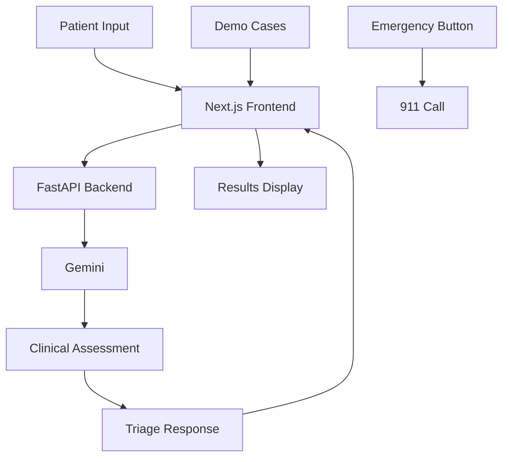

# 🩺 AI Fever Triage System
*Intelligent Emergency Decision Support powered by AI*

[](https://opensource.org/licenses/MIT)
[](https://www.python.org/downloads/)
[](https://nextjs.org/)
[](https://fastapi.tiangolo.com/)

## 🎯 Problem Statement

Emergency departments worldwide face critical challenges:
- **Overcrowding**: 145 million ER visits annually in the US alone
- **Delayed Care**: Average wait times of 2-4 hours for non-critical patients
- **Misdiagnosis**: Up to 12% of ER visits result in diagnostic errors
- **Resource Strain**: Healthcare workers overwhelmed during peak periods

**Fever cases** represent 20% of all ER visits, with varying severity from common viral infections to life-threatening sepsis requiring immediate intervention.

## 💡 Solution

An AI-powered triage system that provides **instant, evidence-based fever assessments** using:
- ✅ OpenAI GPT-4 with medical training
- ✅ Clinical decision support protocols  
- ✅ SIRS criteria for sepsis detection
- ✅ Four-tier severity classification
- ✅ Real-time red flag identification

## 🌟 Key Features

### 🏥 **Clinical Intelligence**
- Evidence-based medicine protocols
- SIRS criteria implementation  
- Age-specific medical considerations
- Differential diagnosis ranking

### ⚡ **Real-time Assessment**
- Instant AI-powered triage
- Confidence scoring (0-100%)
- Red flag symptom detection
- Emergency escalation protocols

### 🎨 **Healthcare-Grade UI**
- Mobile-responsive design
- Color-coded severity levels
- Emergency action buttons
- Professional medical interface

### 🛡️ **Safety-First Design**
- Always errs on side of caution
- Prominent emergency controls
- Clear medical disclaimers
- Critical case prioritization

## 🏗️ System Architecture



## 🔧 Tech Stack

| Component | Technology | Purpose |
|-----------|------------|---------|
| **Frontend** | Next.js 14 + TypeScript | Modern React framework with server-side rendering |
| **Backend** | FastAPI + Python | High-performance API with automatic documentation |
| **AI Engine** | OpenAI GPT-4 | Medical knowledge and clinical reasoning |
| **Styling** | Tailwind CSS | Utility-first CSS framework |
| **Deployment** | Vercel + Render | Scalable cloud hosting |

## 📁 Project Structure

```
microlabs/
├── fever-backend/              # FastAPI backend service
│   ├── main.py                # Main API application
│   ├── requirements.txt       # Python dependencies
│   ├── .env                   # Environment variables
│   ├── render.yaml           # Render deployment config
│   └── README.md             # Backend documentation
│
└── fever-triage/              # Next.js frontend application
    ├── app/                   # Next.js 14 app directory
    │   ├── layout.tsx        # Root layout
    │   ├── page.tsx          # Main triage page
    │   └── globals.css       # Global styles
    ├── components/           # React components
    │   ├── SymptomForm.tsx   # Patient input form
    │   ├── ResultsDisplay.tsx # Triage results
    │   └── DemoCases.tsx     # Demo scenarios
    ├── lib/
    │   └── api.ts            # API client
    ├── package.json          # Dependencies
    ├── vercel.json          # Vercel deployment
    └── README.md            # Frontend documentation
```

## 🚀 Quick Start

### Prerequisites
- Python 3.11+
- Node.js 18+
- OpenAI API key

### 1. Backend Setup
```bash
cd fever-backend

# Create virtual environment
python -m venv venv
source venv/bin/activate  # On Windows: venv\Scripts\activate

# Install dependencies
pip install -r requirements.txt

# Set up environment
cp .env.example .env
# Edit .env and add your OPENAI_API_KEY

# Run backend
uvicorn main:app --reload --host 0.0.0.0 --port 8000
```

### 2. Frontend Setup
```bash
cd fever-triage

# Install dependencies
npm install

# Set up environment
cp .env.local.example .env.local
# Edit .env.local: NEXT_PUBLIC_API_URL=http://localhost:8000

# Run frontend
npm run dev
```

### 3. Access Application
- **Frontend**: http://localhost:3000
- **Backend API**: http://localhost:8000
- **API Docs**: http://localhost:8000/docs

## 🎯 Demo Scenarios

Test the system with pre-configured cases:

### 1. **Common Cold** (LOW Severity)
- Temperature: 99.8°F
- Duration: 24 hours  
- Symptoms: Sore throat, runny nose
- Expected: Home care recommendation

### 2. **Influenza** (MEDIUM Severity)  
- Temperature: 102.5°F
- Duration: 18 hours
- Symptoms: Body aches, chills, headache
- Expected: See doctor within 24-48 hours

### 3. **Pneumonia** (HIGH Severity)
- Temperature: 103.8°F  
- Duration: 48 hours
- Symptoms: Chest pain, cough, difficulty breathing
- Expected: Same-day medical attention

### 4. **Critical Sepsis** (CRITICAL Severity)
- Temperature: 105.0°F
- Duration: 8 hours  
- Symptoms: Confusion, rapid heartbeat, chills
- Expected: **IMMEDIATE ER REQUIRED**

## 📊 Triage Classification

| Severity | Temperature | Action Required | Timeline |
|----------|-------------|-----------------|----------|
| **LOW** | <101°F | Self-care, monitor symptoms | Home care |
| **MEDIUM** | 101-103°F | See healthcare provider | 24-48 hours |
| **HIGH** | >103°F | Medical attention needed | Same day |
| **CRITICAL** | >104°F + red flags | **EMERGENCY CARE** | **IMMEDIATE** |

### 🚨 Red Flag Symptoms (Auto-Critical)
- Altered mental status / confusion
- Stiff neck with fever (meningitis)
- Difficulty breathing / chest pain
- Rapid heart rate with low blood pressure
- Petechial rash
- Severe dehydration

## 🌐 Deployment

### Backend (Render)
1. Connect GitHub repository to Render
2. Create new Web Service  
3. Configure:
   - Runtime: Python 3.11
   - Build: `pip install -r requirements.txt`
   - Start: `uvicorn main:app --host 0.0.0.0 --port $PORT`
   - Environment: `OPENAI_API_KEY`

### Frontend (Vercel)
1. Connect GitHub repository to Vercel
2. Framework: Next.js
3. Environment Variables:
   - `NEXT_PUBLIC_API_URL`: Your backend URL

## 📈 API Documentation

### Endpoints

#### `POST /api/triage`
Submit patient data for AI assessment.

**Request:**
```json
{
  \"temperature\": 102.5,
  \"duration_hours\": 24,
  \"symptoms\": [\"headache\", \"chills\"],
  \"age\": 35,
  \"medical_history\": \"No significant history\"
}
```

**Response:**
```json
{
  \"severity\": \"MEDIUM\",
  \"diagnosis_suggestions\": [\"Viral infection\", \"Early flu\"],
  \"recommended_action\": \"See doctor within 24-48 hours\",
  \"clinical_explanation\": \"Patient presents with moderate fever...\",
  \"red_flags\": [\"Monitor for breathing difficulty\"],
  \"confidence_score\": 0.85
}
```

#### `GET /api/health`
Backend health check.

## 🎥 Demo Video Script

### 1. **Introduction** (30s)
- Problem: ER overcrowding, 145M visits/year
- Solution: AI-powered triage for faster decisions

### 2. **Low Severity Demo** (45s)
- Input: Common cold symptoms
- Output: LOW severity, home care recommendation
- Show confidence score and reasoning

### 3. **Critical Severity Demo** (45s)
- Input: Sepsis symptoms (high fever + confusion)
- Output: CRITICAL alert with emergency protocols
- Demonstrate red flag detection

### 4. **Technical Overview** (45s)
- Architecture: Next.js + FastAPI + GPT-4
- Show API documentation and real-time processing
- Highlight safety features

### 5. **Impact & Future** (45s)
- Potential to reduce ER wait times
- Scalability for global healthcare systems
- Integration with wearables and EHR systems

### 6. **Call to Action** (30s)
- GitHub repository showcase
- Live demo deployment
- Future collaboration opportunities

## 🔮 Roadmap

### Phase 1: Core System ✅
- [x] AI-powered triage assessment
- [x] Four-tier severity classification  
- [x] Responsive web interface
- [x] Emergency protocols

### Phase 2: Enhanced Features 🚧
- [ ] Multi-language support (Spanish, French, etc.)
- [ ] Integration with wearable devices
- [ ] Patient history tracking
- [ ] Clinical decision trees

### Phase 3: Healthcare Integration 📋
- [ ] EHR system compatibility
- [ ] HIPAA compliance implementation  
- [ ] Clinical validation studies
- [ ] Regulatory approval process

### Phase 4: Advanced AI 🤖
- [ ] Custom medical language models
- [ ] Image analysis (rash recognition)
- [ ] Predictive analytics
- [ ] Population health insights

## 🏥 Clinical Validation

### Evidence Base
- **SIRS Criteria** for sepsis detection
- **Fever Guidelines** from American College of Emergency Physicians
- **Triage Protocols** from Emergency Nurses Association
- **Pediatric Considerations** for age-specific care

### Limitations
- Not intended for emergency diagnosis
- Requires clinical validation before medical use
- Should complement, not replace, clinical judgment
- Regulatory approval needed for patient care

## 🤝 Contributing

We welcome contributions from:
- **Healthcare Professionals**: Clinical knowledge and validation
- **Developers**: Feature development and bug fixes  
- **Researchers**: Evidence-based improvements
- **UX Designers**: User experience enhancements

### Development Process
1. Fork the repository
2. Create feature branch (`git checkout -b feature/clinical-improvement`)
3. Commit changes (`git commit -m 'Add sepsis detection improvement'`)
4. Push to branch (`git push origin feature/clinical-improvement`)
5. Create Pull Request

## 📜 Medical Disclaimer

⚠️ **CRITICAL DISCLAIMER**: This application is designed for **educational and demonstration purposes only**. It is not intended to provide medical advice, diagnosis, or treatment. This system has not been clinically validated or approved by regulatory authorities for patient care.

**Always:**
- Consult qualified healthcare professionals
- Call 911 for medical emergencies
- Seek immediate care for concerning symptoms
- Use clinical judgment over AI recommendations

## 📄 License

This project is licensed under the MIT License - see the [LICENSE](LICENSE) file for details.

---

## 📞 Support & Contact

- **Issues**: GitHub Issues for bug reports
- **Discussions**: GitHub Discussions for questions
- **Security**: security@example.com for vulnerabilities
- **Clinical**: medical@example.com for healthcare inquiries

**Built with ❤️ for healthcare innovation**
